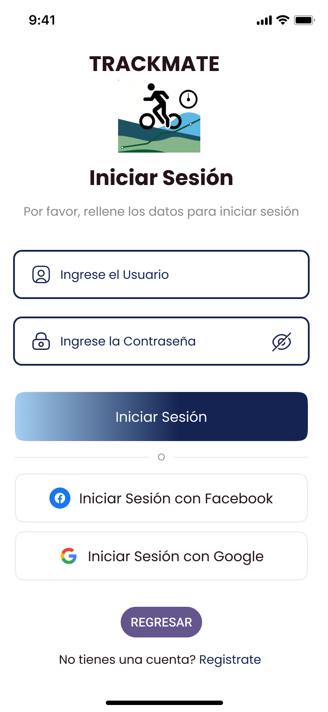

# Track-Mate

**Track-Mate** es una aplicación intuitiva y funcional diseñada para realizar el seguimiento de actividades físicas al aire libre, como correr, caminar o andar en bicicleta, utilizando tecnologías como GPS, acelerómetro y giroscopio para proporcionar estadísticas en tiempo real y una experiencia visual optimizada para actividades tanto diurnas como nocturnas.

## Tabla de Contenidos

1. [Descripción del Proyecto](#descripción-del-proyecto)
2. [Características Principales](#características-principales)
3. [Instalación](#instalación)
4. [Cómo Usar la Aplicación](#cómo-usar-la-aplicación)
5. [Estructura del Proyecto](#estructura-del-proyecto)

---

## Descripción del Proyecto

**Track-Mate** está diseñado para deportistas y aficionados al aire libre que desean monitorear y mejorar su rendimiento. La aplicación proporciona una plataforma social donde los usuarios pueden compartir sus rutas, logros y consejos con otros miembros de la comunidad.


---

## Características Principales

- **Seguimiento en tiempo real**: La aplicación ofrece estadísticas detalladas de tus actividades mediante GPS.
- **Rutas y mapas**: Visualización clara y precisa de las rutas recorridas y puntos de interés.
- **Comunidad interactiva**: Comparte tus logros y rutas con otros usuarios.
- **Modo gratuito y premium**: Acceso a funciones avanzadas con una suscripción.
- **Compatibilidad**: La app está optimizada para funcionar con los dispositivos más recientes.

---

## Instalación

1. Clona este repositorio a tu máquina local:
   ```bash
   git clone https://github.com/usuario/track-mate.git
   ```

## Cómo Usar la Aplicación

### Pantalla de Inicio (Home)

La pantalla de inicio presenta un acceso directo para comenzar una nueva actividad y acceder a la vista de las rutas anteriores.

- **Iniciar Sesión**: Los usuarios pueden ingresar usando su cuenta de correo electrónico, Facebook o Google.
- **Registro**: Para los nuevos usuarios, la aplicación ofrece una pantalla de registro intuitiva.



### Página Principal (Home Page)

En esta sección, los usuarios pueden:

- Ver sus rutas recientes y lugares populares cerca de su ubicación.
- Acceder a recomendaciones basadas en su historial y preferencias.
- Buscar rutas y actividades que les interesen.


---

## Estructura del Proyecto

El proyecto está organizado de la siguiente manera:

```bash
├── src
│   ├── assets         # Imágenes y otros activos
│   ├── components     # Componentes Vue.js
│   ├── views          # Vistas principales del proyecto
│   ├── router         # Configuración de rutas
│   └── store          # Estado global de la aplicación (Vuex)
├── public             # Archivos estáticos como favicon, index.html
├── README.md          # Este archivo
└── package.json       # Dependencias y scripts del proyecto
```
